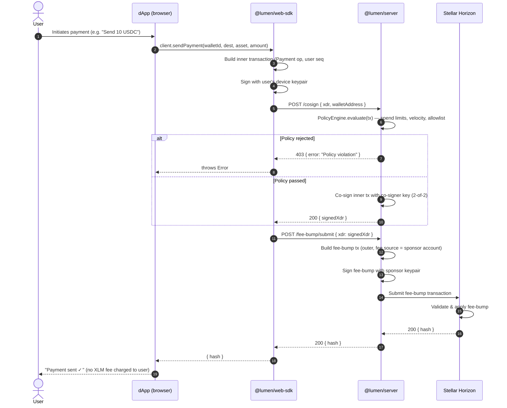

# Gasless Transactions in Lumen

A practical end-to-end guide explaining how Lumen eliminates gas fees for end users using Stellar's **Fee-Bump Transactions** ([CAP-0015](https://github.com/stellar/stellar-protocol/blob/master/core/cap-0015.md)).

---

## Table of Contents

1. [Conceptual Overview](#1-conceptual-overview)
2. [How Fee-Bumps Work in Stellar (CAP-0015)](#2-how-fee-bumps-work-in-stellar-cap-0015)
3. [The Lumen Gasless Flow](#3-the-lumen-gasless-flow)
4. [Sequence Diagram](#4-sequence-diagram)
5. [Code Walkthrough](#5-code-walkthrough)
   - [Using `@lumen/web-sdk`](#using-lumenweb-sdk)
   - [Using `@lumen/react` hooks](#using-lumenreact-hooks)
   - [Raw REST API](#raw-rest-api)
6. [Sponsor Account Security](#6-sponsor-account-security)
7. [Preventing Sponsor Account Drainage](#7-preventing-sponsor-account-drainage)
8. [FAQ](#8-faq)

---

## 1. Conceptual Overview

In traditional blockchains users must hold the network's native token (ETH, SOL, XLM…) to pay transaction fees. This is a significant onboarding barrier: a new user cannot send their first USDC payment until they already hold some XLM to pay for it.

Lumen eliminates this friction entirely. A dedicated **sponsor account** controlled by the server wraps every transaction in a _fee-bump envelope_. The inner transaction is signed by the user's wallet; the outer fee-bump is signed and paid for by the sponsor. From the user's perspective — and from the Stellar network's perspective — the user's account pays zero fees.

---

## 2. How Fee-Bumps Work in Stellar (CAP-0015)

A Stellar **fee-bump transaction** is a special transaction type introduced in [CAP-0015](https://github.com/stellar/stellar-protocol/blob/master/core/cap-0015.md). It wraps an existing signed transaction (the _inner_ transaction) inside an outer envelope that:

- Specifies a **fee source** — the account that pays the fee (the sponsor).
- Provides a **higher fee** than the inner transaction's declared fee.

When the network processes a fee-bump, the inner transaction's fee field is effectively ignored. The fee is debited from the fee-source account instead. The inner transaction's source account needs zero XLM for fees.

Key properties:

| Property | Detail |
| --- | --- |
| Inner transaction | Must already be valid and signed by the required signers. |
| Fee source | Any Stellar account with enough XLM to cover the fee. |
| Fee multiplier | The outer fee must be ≥ inner declared fee. |
| Inner nonce | Uses the inner source account's sequence number as usual. |
| Replay protection | Same as standard transactions — sequence number prevents replay. |

---

## 3. The Lumen Gasless Flow

The complete flow involves four actors:

| Actor | Role |
| --- | --- |
| **User's device** | Builds and signs the inner payment transaction. |
| **`@lumen/server` (cosigner)** | Validates the transaction against policy rules and co-signs (2-of-2 multisig). |
| **`@lumen/server` (fee sponsor)** | Wraps the co-signed transaction in a fee-bump envelope, signs it with the sponsor key, and submits to Horizon. |
| **Stellar network** | Processes the fee-bump, credits the destination, debits the fee from the sponsor account. |

The user's account is never charged a fee. The only XLM the user needs is the minimum account reserve (1 XLM), which the server also sponsors at wallet creation time.

---

## 4. Sequence Diagram



---

## 5. Code Walkthrough

### Using `@lumen/web-sdk`

The simplest integration. `LumenClient` handles wallet management, signing, co-signing, and fee-bumping in a single call:

```typescript
import { LumenClient } from "@lumen/web-sdk";

const client = new LumenClient({
  network:         "testnet",
  serverUrl:       "https://your-lumen-server.example.com",
  sponsorSecret:   process.env.SPONSOR_SECRET!,  // server-side only
  serverPublicKey: process.env.SERVER_PUBLIC_KEY!,
});

// 1. Create a seedless wallet (server sponsors the XLM reserve)
const { address, id } = await client.createWallet();

// 2. Send a payment — fully gasless, no XLM needed in the wallet
const { hash } = await client.sendPayment(
  id,                // wallet id
  "GDEST...XYZ",    // destination
  "USDC",           // asset code (must be in KNOWN_ASSETS for the network)
  "10.00",          // amount
);

console.log("Transaction hash:", hash);
// The user's wallet was never charged a fee.
```

Under the hood `sendPayment` calls:
1. `wallet.buildPaymentTransaction()` — builds and signs the inner tx.
2. `POST /cosign` — server validates policy and co-signs.
3. `POST /fee-bump/submit` — server wraps in fee-bump, signs with sponsor key, submits.

---

### Using `@lumen/react` hooks

For React dApps, the `useSendPayment` hook provides the same flow with built-in loading and error state:

```tsx
import { LumenProvider, useSendPayment } from "@lumen/react";
import { LumenClient } from "@lumen/web-sdk";

// Set up the client once (e.g. in your app root)
const client = new LumenClient({
  network:         "testnet",
  serverUrl:       "https://your-lumen-server.example.com",
  sponsorSecret:   import.meta.env.VITE_SPONSOR_SECRET,
  serverPublicKey: import.meta.env.VITE_SERVER_PUBLIC_KEY,
});

function App() {
  return (
    <LumenProvider client={client}>
      <PaymentButton walletId="GABC..." />
    </LumenProvider>
  );
}

function PaymentButton({ walletId }: { walletId: string }) {
  const { sendPayment, loading, error, data } = useSendPayment();

  const handleSend = async () => {
    await sendPayment({
      walletId,
      destination: "GDEST...XYZ",
      assetCode:   "USDC",
      amount:      "10.00",
    });
  };

  return (
    <>
      <button onClick={handleSend} disabled={loading}>
        {loading ? "Sending…" : "Send 10 USDC (gasless)"}
      </button>
      {error && <p>Error: {error.message}</p>}
      {data  && <p>Sent! Hash: {data.hash}</p>}
    </>
  );
}
```

---

### Raw REST API

If you are not using the SDK you can drive the gasless flow directly with HTTP calls:

```bash
# 1. Build and sign the inner transaction (XDR) in your application.
#    The inner tx must include the user's signature and meet Stellar validity rules.

INNER_XDR="AAAAAGX..."   # base64-encoded XDR of the signed inner transaction
WALLET_ADDRESS="GABC..."

# 2. Submit the signed inner transaction to /cosign.
#    The server validates against spend limits, velocity, and allowlist rules,
#    then co-signs with its co-signer key.

COSIGN_RESPONSE=$(curl -s -X POST https://your-lumen-server.example.com/cosign \
  -H "Content-Type: application/json" \
  -H "Authorization: Bearer $API_KEY" \
  -d "{\"xdr\": \"$INNER_XDR\", \"walletAddress\": \"$WALLET_ADDRESS\"}")

SIGNED_XDR=$(echo "$COSIGN_RESPONSE" | jq -r '.signedXdr')

# 3. Submit the co-signed XDR to /fee-bump/submit.
#    The server wraps it in a fee-bump envelope signed by the sponsor account
#    and submits the bundle to Horizon.

curl -s -X POST https://your-lumen-server.example.com/fee-bump/submit \
  -H "Content-Type: application/json" \
  -H "Authorization: Bearer $API_KEY" \
  -d "{\"xdr\": \"$SIGNED_XDR\"}"

# Response: { "hash": "abc123..." }
# The user's account was not charged any fee.
```

---

## 6. Sponsor Account Security

The sponsor account is the account that pays all transaction fees on behalf of users. Protecting it is critical:

### Never put the sponsor secret in client-side code

The `sponsorSecret` in `LumenClientOpts` is only safe for server-side or trusted environments. In a browser-based dApp, the server should hold the sponsor secret and expose only the `/cosign` and `/fee-bump/submit` endpoints.

### Use a hardware-backed signer in production

`@lumen/server` ships implementations for AWS KMS, GCP KMS, and HashiCorp Vault. Use one of these instead of `EnvSigner` for any deployment handling real funds:

```typescript
import { AwsKmsSigner } from "@lumen/server";

const signer = await AwsKmsSigner.fromEnv();
// Configure via AWS_KMS_KEY_ID, AWS_REGION in your environment.
```

### Rotate sponsor keys periodically

Because the sponsor account holds XLM but not user funds, rotating its key is lower-risk than rotating co-signer keys. Schedule quarterly rotations and drain the old account before decommissioning.

---

## 7. Preventing Sponsor Account Drainage

A poorly configured sponsor account can be drained by legitimate users sending many small transactions. Lumen provides several layers of protection:

### Per-wallet spend limits

Configure the `PolicyEngine` to enforce per-transaction and daily spend caps per wallet:

```typescript
import { createSpendLimitPolicy, createVelocityPolicy } from "@lumen/server";

// Reject any single payment exceeding 100 USDC
await fetch("https://your-server.example.com/policy", {
  method:  "POST",
  headers: { "Content-Type": "application/json" },
  body: JSON.stringify({
    walletId: "GABC...",
    rules: [
      createSpendLimitPolicy({ asset: "USDC", maxPerTx: "100", maxDaily: "500" }),
      createVelocityPolicy({ maxTransactions: 20, windowSeconds: 3600 }),
    ],
  }),
});
```

### Session key caps

When using session keys for micropayments, always set a `spendCap`:

```typescript
const sessionKey = client.createSessionKey(300); // 5 minutes

await fetch("/session-key", {
  method: "POST",
  body: JSON.stringify({
    walletAddress,
    durationSeconds: 300,
    spendLimit: { asset: "XLM", maxPerTx: 0.1, maxTotal: 10 },
  }),
});
```

### Sponsor balance monitoring

Enable `SponsorMonitorService` to receive webhook alerts when the sponsor account balance falls below a threshold:

```typescript
import { SponsorMonitorService } from "@lumen/server";

const monitor = new SponsorMonitorService({
  client,
  sponsorPublicKey: process.env.SPONSOR_PUBLIC_KEY!,
  thresholdXlm:     50,    // alert when below 50 XLM
  dispatcher:       webhookDispatcher,
});

monitor.start();
// Fires a `balance.low` webhook event when the threshold is breached.
```

---

## 8. FAQ

**Q: Does the user need to hold any XLM at all?**

No. The server sponsors both the account reserve (via `createSponsoredAccount`) and all transaction fees (via fee-bump). A user's wallet can have zero XLM and still send USDC payments.

**Q: What happens if the sponsor account runs out of XLM?**

Fee-bump submission will fail with a `tx_insufficient_fee` or `tx_bad_auth_extra` error. Monitor the sponsor balance using `SponsorMonitorService` and set up alerts well in advance of depletion.

**Q: Can fee-bumping be abused to drain the sponsor?**

Each transaction costs a small fee (100 stroops = 0.00001 XLM by default). At 1,000 transactions per second that is 0.01 XLM/second. Rate limiting (`RATE_LIMIT_MAX`) and spend limit policies are your primary defences. Start with conservative limits and loosen them as you validate usage patterns.

**Q: Is the inner transaction stored anywhere?**

No. `@lumen/server` co-signs and immediately submits the fee-bumped transaction to Horizon. Lumen does not persist transaction XDR internally (though you may configure a delivery log for webhooks).

**Q: Can I use fee-bumping with Soroban smart contracts?**

Yes. Soroban transactions can be fee-bumped just like classic transactions. Use `client.invokeContract()` — it follows the same cosign → fee-bump → submit path.

---

*Back to [README](../../README.md) · See also [examples/session-keys](../../examples/session-keys/README.md)*
